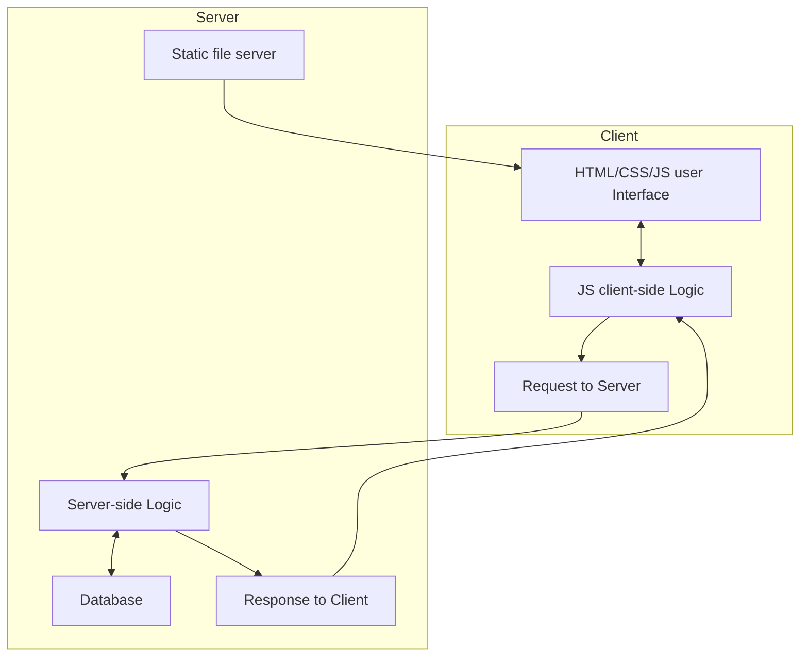
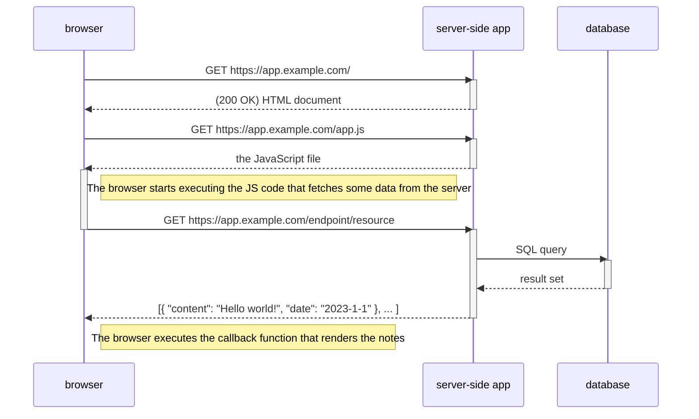

# Getting started with server-side development

## Tools

Like on the previous course:

- [Toolchain - JavaScript](https://github.com/ilkkamtk/web-ohjelmoinnin-perusteet/blob/main/tools_pt1.md)
- [Toolchain - TypeScript](https://github.com/ilkkamtk/web-ohjelmoinnin-perusteet/blob/main/tools_pt2.md)
- [Git](https://github.com/mattpe/git-intro/blob/main/git-basics.md)
- [Postman](https://www.postman.com/), Postman [VS Code extension](https://marketplace.visualstudio.com/items?itemName=Postman.postman-for-vscode) or VS Code [REST Client](https://marketplace.visualstudio.com/items?itemName=humao.rest-client) extension

and:

- A Relational database management system, _DBMS_ (MariaDB or MySql), [Some install instructions](https://gist.github.com/mattpe/b8decf207ef8df9d17d04c1361de9864)

---

## Architecture and concepts

Client-server architecture in web applications

1. Web browser (the Client) loads HTML, CSS, JavaScript, images and other static UI files from the server.
1. The user interacts with the user interface on the client side.
1. Based on the interaction, the Client-side Logic prepares a request to send to the server.
1. The request is sent to the Server.
1. On the server side, the server-side logic processes the request. This may involve querying a database or performing other operations.
1. The server generates a response and sends it back to the client. The response can be in the form of HTML, CSS, JavaScript, or data in other formats like **JSON** or XML.
1. The client processes the response, updating the User Interface or performing other actions as necessary. This mechanism is often referred to as "Client-Side Rendering".

### REST

**Re**presentational **S**tate **T**ransfer, is an architectural style for designing distributed systems. REST is often used in the context of web services, especially when building APIs. RESTful architecture is based on [HTTP protocol](https://github.com/ilkkamtk/web-ohjelmoinnin-perusteet/blob/main/http-request-response.md). In this course we build a REST interface for client-server communication.

Key concepts of REST:

- **Statelessness**: Each request from a client to a server must contain all the information needed to understand and process the request. The server should not retain any client state between requests. This makes it easier to scale, as there's no session information to manage between requests.
- **Client-Server**: The client and server are separate entities that communicate over a network. The client is responsible for the user interface and user experience, while the server is responsible for processing requests, managing data, and executing most of the business logic.
- **Cacheability**: Responses from the server can be labeled as cacheable or non-cacheable. When a response is cacheable, clients can reuse it for equivalent requests in the future, leading to better performance and reduced server load.
- **Uniform Interface**: This is one of the central tenets of REST. It simplifies and decouples the architecture, allowing each part to evolve independently. Key constraints that define this uniform interface include:
- **Resource Identification**: Each resource (like a user, product, etc.) is identified by a unique URI (Uniform Resource Identifier). e.g. `https://example.com/resource/id`
- **Resource Manipulation through Representations**: Clients interact with resources by getting and modifying their representations (usually in formats like **JSON** or XML).
- **Self-descriptive Messages**: Each message contains enough information about how to process the message (e.g., using HTTP methods and status codes).
- **Standard Methods**: In the context of web services and APIs, REST usually relies on standard HTTP methods:
  - GET: Retrieve a resource or list of resources.
  - POST: Create a new resource.
  - PUT: Update a resource.
  - DELETE: Remove a resource.
  - PATCH: Apply partial modifications to a resource.
- **Status Codes:** Each response is served with an appropriate [HTTP status code](https://developer.mozilla.org/en-US/docs/Web/HTTP/Status).
- **Stateless Communication**: Responses from the server should clearly indicate their cacheability to help clients understand when a resource's representation is fresh and when it needs to be re-requested.

REST APIs are popular due to their simplicity, scalability, and performance. When an API adheres to these principles, it's often referred to as a "RESTful" API.

## Server-side technologies

Programming language + application framework + database + runtime environment (server) = server-side (back-end) application

- Programming language is a tool for writing code, specifying algorithms, and instructing a computer.
- Framework is a higher-level structural foundation that provides guidelines, pre-written code, and tools for building applications in a specific domain. Developers often use programming languages within the context of a framework to streamline the development process and adhere to best practices for a particular type of application, such as web development or mobile app development.
- Running environment, often referred to as the "runtime environment" or simply the "runtime," is the software and hardware infrastructure where the server-side code of an application executes. This environment provides the necessary resources and services for the server-side code to run, handle requests, process data, and generate responses.
- All permanent data used by the application itself or saved by the users of the application is stored in the database
- Relational databases like MySQL, PostgreSQL, and NoSQL databases like MongoDB, Cassandra, and Redis are commonly used for storing and retrieving data in web applications.

### Python

- Python is a high-level, interpreted, and versatile programming language known for its simplicity, readability, and extensive standard library.
- Flask is a lightweight web framework for Python. It is designed to be simple and easy to use, making it an excellent choice for building web applications, particularly when you want to get a project up and running quickly. Flask provides the basic tools and libraries needed for web development without imposing too much structure or unnecessary complexity.
- Django is a high-level web framework built on Python. Django follows the MVC architectural pattern and provides a wide range of built-in features for rapid web application development.

### PHP

- PHP is a server-side scripting language designed specifically for web development. It powers a significant portion of the web.
- Frameworks like Laravel and Symfony provide modern tools and patterns for PHP web application development.
- Popular blog/website application Wordpress is written in PHP
- Most web hotels and e.g. <users.metropolia.fi> home page server support PHP runtime by default

### Java

- Java is a widely used programming language for building robust and scalable web applications.
- Spring Boot is a framework that simplifies Java web development by providing a set of conventions and tools for creating production-ready applications.

### ASP.NET

- ASP.NET is an open-source, server-side web-application framework developed by Microsoft
- Supports .NET languages like C#

### Ruby on Rails

Ruby on Rails, often referred to as Rails, is a web application framework written in Ruby. It emphasizes convention over configuration and follows the Model-View-Controller (MVC) architectural pattern, making it a productive choice for building web applications.

### JavaScript and Node.js

- JavaScript is a high-level, often just-in-time compiled language that follows the [ECMAScript standard](https://www.ecma-international.org/publications-and-standards/standards/ecma-262/).
- The ECMAScript standard does not include any input/output (I/O), such as networking, storage, text, or graphics. In practice, the web browser or other runtime system provides APIs for I/O.
- Node.js is a popular runtime environment that allows developers to write server-side code in JavaScript. It is known for its non-blocking, event-driven architecture, making it well-suited for building scalable and high-performance web applications.
- Express.js is a minimal and flexible Node.js web application framework that provides a robust set of features for building web and mobile applications. It is often used for creating RESTful APIs.
- Recap: [Node.js](https://github.com/ilkkamtk/web-ohjelmoinnin-perusteet/blob/main/node.md) & [npm](https://github.com/ilkkamtk/web-ohjelmoinnin-perusteet/blob/main/npm.md)

---

Next: [Basics of Node.js](./02-nodejs-basics.md)
