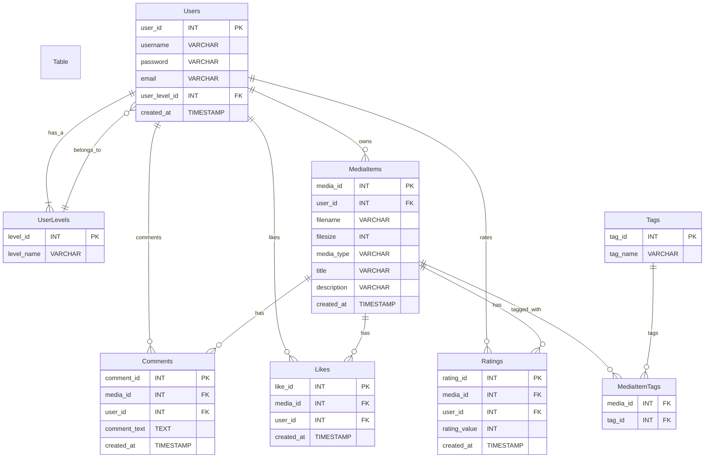

# Databases and Node Express

## Simple Media sharing REST API example database design

Entity-relationship diagram



- Each user can own multiple media items but each media item belongs to one user (owns relationship).
- Each user can comment, like, and rate multiple media items (comments, likes, and rates relationships).
- Media items can have multiple comments, likes, and ratings.
- Each user belongs to one user level (belongs_to relationship) but each user level can be associated with multiple users.
- Media items can be associated with multiple tags via the MediaItemTags table (tagged_with relationship). Each tag can tag multiple media items.

## Database normalization

[Database normalization](https://en.wikipedia.org/wiki/Database_normalization) is a process used to organize a relational database into tables and columns. The idea is to divide a database into two parts: data and relationships between the data with following objectives:

- **Minimize Redundancy**: Ensure that the data is stored only once, eliminating duplicate data, which can save space and reduce inconsistencies.
- **Minimize Insert/Update/Delete Anomalies**: Anomalies can occur when data is added, deleted, or updated. Normalization helps reduce these anomalies by ensuring that data is structured logically.
- **Increase Data Integrity**: By reducing redundancy, normalization helps maintain data integrity, ensuring that the data within the database is accurate and consistent.
- **Optimize Queries**: Well-normalized tables can lead to more efficient queries by reducing the amount of data that needs to be scanned for a given query.

Normalization involves applying a series of rules to a database design, known as normal forms:

- **First Normal Form (1NF)**: Each column in a table should contain atomic, indivisible data, and there should be no repeating groups.
- **Second Normal Form (2NF)**: The table is in 1NF, and all the non-primary-key columns are fully functionally dependent on the primary key.
- **Third Normal Form (3NF)**: The table is in 2NF, and all its columns are not only fully functionally dependent on the primary key but also non-transitively dependent. This means that no non-primary-key column should be dependent on another non-primary-key column.

There are even higher normal forms, like the Fourth Normal Form (4NF), which deals with multi-valued dependencies, and the Fifth Normal Form (5NF), which deals with joins, but these are less commonly applied in practical database design. In most cases, 3NF is sufficient and provides a a good balance between normalization benefits and performance considerations.

## Example database setup and some sample data

Review and import [this script file](assets/media-db.sql)

## Advanced SQL queries

### Grouping and aggregation

Query result may have several identical rows. To get unique rows only, use `DISTINCT`:

```sql
SELECT DISTINCT media_type FROM MediaItems;
```

Use `GROUP BY` clause to group resulting groups by column(s). With one column works similarly to `DISTINCT` but grouping can be done by many columns:

```sql
-- one column
SELECT media_type FROM MediaItems GROUP BY media_type;
-- two columns
SELECT media_type, filesize FROM MediaItems
  GROUP BY media_type, filesize;
```

Note if grouping is used, you can only SELECT columns that are

- Part of GROUP BY
- Part of aggregate function

For example, the query below is ambigious (which filesize to select for each media_type?):

```sql
SELECT media_type, filesize FROM MediaItems
  GROUP BY media_type;
```

Groups can be filtered by `HAVING` clause:

```sql
-- select media types having more than one item
SELECT media_type FROM MediaItems
  GROUP BY media_type
  HAVING COUNT(media_type) > 1;

-- select media types and count of them having more than one item
SELECT media_type, COUNT(media_type) AS count
  FROM MediaItems
  GROUP BY media_type
  HAVING count > 1;
```

Aggregate functions can be applied to groups defined by `GROUP BY`

- If no grouping in specified, the aggregate function applies to the query result as a whole
- For example, aggregate function `COUNT(*)` returns the record count within each group
- Some aggregate functions
  - `AVG`: Average
  - `COUNT`: Count
  - `MIN`: Minimum value
  - `MAX`: Maximum value
  - `STDDEV`: Standard deviation
  - `SUM`: Sum

```sql
-- select min and max filesizes
SELECT MIN(filesize), MAX(filesize) FROM MediaItems;

-- select total size of all media items
SELECT SUM(filesize) FROM MediaItems;

-- select min, max and rounded average filesizes for each media type
SELECT media_type, MIN(filesize), MAX(filesize), ROUND(AVG(filesize)) AS average
  FROM MediaItems
  GROUP BY media_type;
```

### Subqueries

`SELECT`, `UPDATE` and `DELETE` operations may contain other SELECT queries as a subqueries

- can be nested, the innermost query is executed first
- Membership in inner query’s result set can be tested with `IN` or `NOT IN` operator

```sql
-- Select all media files tagged with 'Nature' using subqueries
SELECT title, description, filename FROM MediaItems
  WHERE media_id IN (
    SELECT media_id FROM MediaItemTags WHERE tag_id = (
      SELECT tag_id FROM Tags WHERE tag_name = 'Nature'
    )
  );
```

### Some example queries

```sql
-- Select media item which has the most likes
SELECT media_id, COUNT(media_id) AS likes
  FROM Likes GROUP BY media_id
  ORDER BY likes DESC LIMIT 1;

-- select username who have most likes for their media items
SELECT username, COUNT(media_id) AS likes
  FROM Likes
  JOIN Users ON Likes.user_id = Users.user_id
  GROUP BY username ORDER BY likes DESC LIMIT 1;

-- user 'JohnDoe' likes media item with id 1
INSERT INTO Likes (media_id, user_id)
  VALUES (1, (
      SELECT user_id FROM Users WHERE username = 'JohnDoe'
    )
  );

-- user with id 1 comments on media item with id 1: "Nice photo!"
INSERT INTO Comments (media_id, user_id, comment_text) VALUES (1, 1, 'Nice photo!');

-- select all comments and usernames for media item with id 1
SELECT Comments.created_at, username, comment_text
  FROM Comments
  JOIN Users ON Comments.user_id = Users.user_id
  WHERE media_id = 1;

-- update user level of user 'JaneDoe' (id is known) to 'Admin'
UPDATE Users SET user_level_id =
  (SELECT level_id FROM UserLevels WHERE level_name = 'Admin')
  WHERE user_id = 2;

```

## Links & extra material

- [TutorialsTeacher: Learn SQL (Standard Query Language) for Databases](https://www.tutorialsteacher.com/sql)
- [W3Schools: SQL Tutorial](https://www.w3schools.com/sql/)

---

## Assignment 3B - Database design for you project application

Thing about the features of your server-side application/API. What kind of data is needed to store in the database to implement all of the requirements/functionalities of your app?

1. List your requirements/functionalities
1. Identify and design the entities (tables) and relations between them
1. Draw a diagram of the database structure (including relations between tables)
   - [ERDPlus](https://erdplus.com/) is a free online tool for drawing DB diagrams (choose Relational schema as the diagram type)
1. Define the data types for the columns
1. Define primary keys and foreign keys
1. Implement SQL statements for creating the tables
1. Insert some records of mock data into them.
1. Think about use cases for the data from the application point of view and provide examples how to update, delete and query the data in a meaningful way
   - describe the use cases in SQL script comments
1. Create a script including all your SQL statements (create tables, insert data, queries, updates, etc.)
   - `mysqldump` command can be used to create a script from an existing database

**Returning:** Check assignment in OMA.

**Grading:** max 4 points
