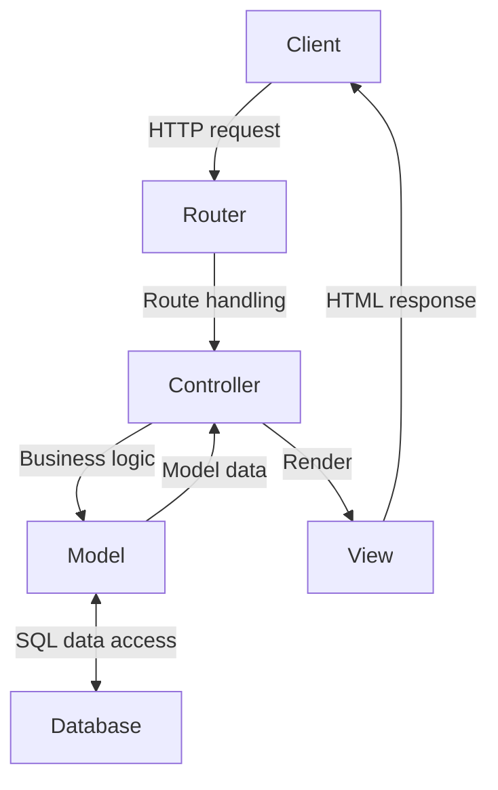
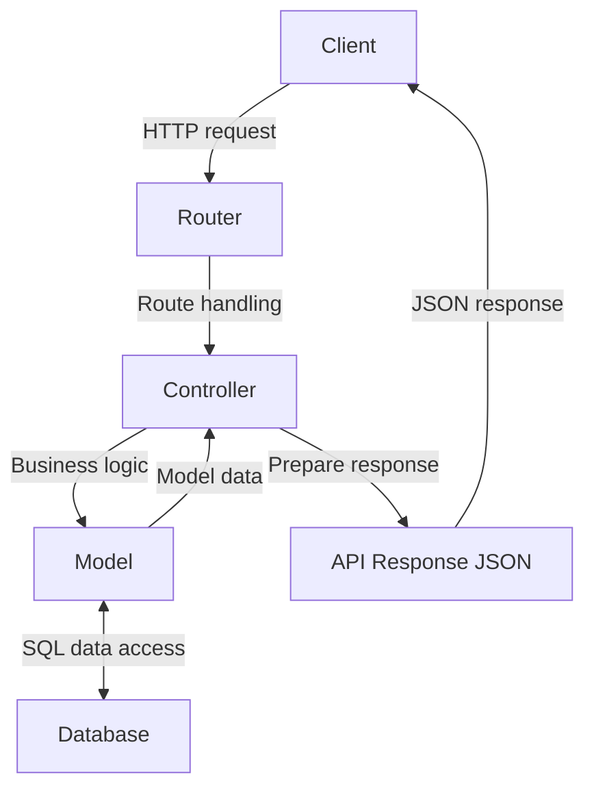

# Routing and middlewares in Express

## Model-View-Controller (MVC)

MVC is a [design pattern](https://en.wikipedia.org/wiki/Software_design_pattern) that divides the application into three interconnected components:

- **Model**: Represents the application's data and the business rules that govern access to and updates of this data. In many cases, the model component is responsible for retrieving data, processing it, and then storing it. It is independent of the user interface (UI).
- **View**: Represents the UI of the application. It displays the data that the model contains to the user and sends user commands (e.g., button clicks) to the controller. The view is passive, meaning it waits for the model or controller to give it data to display.
- **Controller**: Acts as an intermediary between the Model and the View. It listens to events triggered by the View and executes the appropriate response, often resulting in a change in the Model's state. Similarly, when the Model changes (e.g., data is updated), the Controller is responsible for refreshing the View.

Benefits of MVC:

- Separation of Concerns: By separating the application into these components, MVC aids in the organization of code, making it more modular and scalable. Each component has a distinct responsibility.
- Maintainability: With clear separations, developers can work on one aspect of an application (like the UI) without having to touch the data logic code. This separation allows teams to work on different parts of an application simultaneously.
- Flexibility: The View and the Model can evolve separately. Multiple Views can be created from one Model, which is especially useful when you have web, mobile, and other UIs for the same data.
- Reusability: Business logic in the Model can often be reused across different parts of an application or even different projects.

Many popular web development frameworks like Django (Python), Ruby on Rails (Ruby), ASP.NET MVC (C#), and **Express** with Pug or EJS implement the MVC pattern or variations of it. The MVC pattern has been adapted in slightly different ways by various frameworks, but the core principle remains:

1. When a user sends a n HTTP request, the request first reaches the Controller.
2. The Controller processes the request, interacts with the Model (which might involve querying a database), and then decides which View should be used to display the resulting data.
3. The View takes the data, renders it, and sends the resulting webpage back to the user (server-side rendering, SSR).



When adapted to REST API the view is typically represented by the format of the API response (usually JSON), rather than a traditional user interface which is this case rendered on the client-side (CSR).



## Project structure

Type-based folder structure (typical for Express applications):

```dir
src/
├── controllers/
│   ├── mediaController.js
│   └── userController.js
├── models/
│   ├── mediaModel.js
│   └── userModel.js
├── routes/
│   ├── mediaRoutes.js
│   └── userRoutes.js
└── index.js
```

Feature-based folder structure:

```dir
src/
├── media/
│   ├── controller.js
│   ├── model.js
│   └── routes.js
├── user/
│   ├── controller.js
│   ├── model.js
│   └── routes.js
└── index.js
```

Both of the folder structures has its benefits. The type-based structure is simple and straightforward, making it easy to navigate for small projects. The feature-based structure, on the other hand, scales better for larger applications by grouping all related files by feature, making the codebase more modular and maintainable.

## Routing in Express

[express.Router](https://expressjs.com/en/guide/routing.html#express-router) is a middleware and more advanced routing system that allows you to modularize your routes into separate files.

### Example

_src/index.js:_

```js
...
import mediaRouter from './routes/media-router.js';

...

// bind base url for all media routes to mediaRouter
app.use('/api/media', mediaRouter);

...

```

_src/routes/media-router.js:_

```js
import express from 'express';
import {
  getMedia,
  getMediaById,
  postMedia,
  putMedia,
  deleteMedia,
} from '../controllers/media-controller.js';

const mediaRouter = express.Router();

mediaRouter.route('/').get(getMedia).post(postMedia);

mediaRouter.route('/:id')
  .get(getMediaById)
  .put(putMedia)
  .delete(deleteMedia);

export default mediaRouter;
```

_src/controllers/media-controller.js:_

```js
import {addMedia, findMediaById, listAllMedia} from "../models/media-model.js";

const getMedia = (req, res) => {
  res.json(listAllMedia());
};

const getMediaById = (req, res) => {
  const media = findMediaById(req.params.id);
  if (media) {
    res.json(media);
  } else {
    res.sendStatus(404);
  }
};

const postMedia = (req, res) => {
  const {filename, title, description, user_id} = req.body;
  if (filename && title && description && user_id) {
    addMedia(req.body);
    res.status(201);
    res.json({message: 'New media item added.'})
  } else {
    res.sendStatus(400);  
  }
};

const putMedia = (req, res) => {
  // not implemented in this example, this was homework
  res.sendStatus(200);
};

const deleteMedia = (req, res) => {
  // not implemented in this example, this was homework
  res.sendStatus(200);
};

export {getMedia, getMediaById, postMedia, putMedia, deleteMedia};
```

_src/models/media-model.js:_

```js
// mock data
const mediaItems = [
  {
    media_id: 9592,
    filename: 'f504.jpg',
    filesize: 48975,
    title: 'Desert',
    description: '',
    user_id: 3609,
    media_type: 'image/jpeg',
    created_at: '2023-10-12T06:59:05.000Z',
  },
  {
    media_id: 9593,
    filename: '60ac.jpg',
    filesize: 23829,
    title: 'Basement',
    description: 'Light setup in basement',
    user_id: 305,
    media_type: 'image/jpeg',
    created_at: '2023-10-12T06:56:41.000Z',
  },
];

const listAllMedia = () => {
  return mediaItems;
};

const findMediaById = (id) => {
  return mediaItems.find((item) => item.media_id == id);
};

const addMedia = (media) => {
  const {filename, title, description, user_id} = media;
  const newId = mediaItems[0].media_id + 1;
  mediaItems.unshift({media_id: newId, filename, title, description, user_id});
};

export {listAllMedia, findMediaById, addMedia};
```

## Middlewares

Middleware functions are functions that have access to the request object (`req`), the response object (`res`), and the next middleware function in the application's request-response cycle. The next middleware function is commonly denoted by a variable named `next`.

Study: [using middleware](https://expressjs.com/en/guide/using-middleware.html) and [writing middleware](https://expressjs.com/en/guide/writing-middleware.html) in Express.

### Handling file uploads

Files are sent in HTTP as [multipart/form-data](https://developer.mozilla.org/en-US/docs/Web/HTTP/Methods/POST). Because Express does not handle this type by default you need to use third party middleware like [Multer](https://github.com/expressjs/multer):

1. Add `uploads` folder to the project and put the folder in version control; but not its content, e.g.

    ```bash
    mkdir uploads
    touch uploads/.gitkeep
    ```

    and edit `.gitignore`:

    ```ignore
    # ignore content of uploads folder
    uploads/*
    # except one (empty) file to have the folder in version control
    !uploads/.gitkeep
    ```

1. Install [Multer](https://github.com/expressjs/multer#readme)
1. Use the basic usage example in Multer's documentation as an example and add file upload functionality to `./routes/mediaRouter.js`.
   - Add a new function `postMedia` to `./controllers/mediaController.js`. Log the form data sent by the client (`req.body`) and the file data (`req.file`) to the console.
   - Add/modify `/` route for post method in `mediaRouter.js`. The route should execute the multer middleware and `postMedia()` controller function.
   - Check `uploads` folder after uploading to see new files.
     - Filenames are automatically hashed.
     - If you want to have more control over filenames use [Diskstorage](https://github.com/expressjs/multer#diskstorage)

```js
// router:
....
import multer from 'multer';
import {postMedia} from '../controllers/media-controller.js';
....
mediaRouter.route('/')
  .post(upload.single('file'), postMedia);
...

// controller:
import {addMedia} from "../models/media-model.js";
...
const postMedia = async (req, res) => {
  const {filename, size, mimetype} = req.file;
  const {title, description, user_id} = req.body;
  if (filename && title && user_id) {
    const result = await addMedia({filename, size, mimetype, title, description, user_id});
    if (result.media_id) {
      res.status(201);
      res.json({message: 'New media item added.', ...result});
    }
    else {
      res.status(500);
      res.json(result);
    }
  } else {
    res.sendStatus(400);  
  }
};
...
export {postMedia};
```

Testing upload with VSCode REST Client:

Image file (`test-cat.png` in this example) must be in the same folder as the `.http` file.

```http
POST http://localhost:3000/api/media
Content-Type: multipart/form-data; boundary=----Boundary

------Boundary
Content-Disposition: form-data; name="title"

New cat image
------Boundary
Content-Disposition: form-data; name="user_id"

21
------Boundary
Content-Disposition: form-data; name="file"; filename="image.png"
Content-Type: image/png

< ./test-cat.png
------Boundary--
```

## Database connection in Express

1. Import the [example database](assets/media-db.sql).
1. Create a database user and granting privileges to the database:

    ```sql
    CREATE USER 'myusername'@'localhost' IDENTIFIED BY 'mypassword';
    GRANT ALL PRIVILEGES ON `databasename`.* TO 'myusername'@'localhost';
    FLUSH PRIVILEGES;
    ```

1. Install [dotenv](https://github.com/motdotla/dotenv#readme) to load environment variables from a `.env` file into `process.env`.
   - `.env` file is used to store sensitive data like database credentials and should not be committed to version control (remember to add to `.gitignore`).
   - Add `.env` file to the project root folder and add the following content to it:

    ```env
    DB_HOST=localhost
    DB_USER=myusername
    DB_PASSWORD=mypassword
    DB_NAME=databasename
    ```

1. Add line `.env` to `.gitignore`.
    - You can store a template of the file in version control as `.env.example`, just remove all sensitive data before committing.
1. Study & install [mysql2](https://github.com/sidorares/node-mysql2#readme) package
1. Create a new file `src/utils/database.js` and add the following code to it:

    ```js
    import mysql from 'mysql2';
    import 'dotenv/config';

    const pool = mysql.createPool({
      host: process.env.DB_HOST,
      user: process.env.DB_USER,
      password: process.env.DB_PASSWORD,
      database: process.env.DB_NAME,
      waitForConnections: true,
      connectionLimit: 10,
      queueLimit: 0,
    });
    const promisePool = pool.promise();
    export default promisePool;
    ```

### MySQL2 examples

JavaScript variables in SQL queries should be handled using [prepared statements](https://sidorares.github.io/node-mysql2/docs#using-prepared-statements) to prevent SQL injection attacks.

>If you have parameters (`SELECT * FROM user WHERE user_id = ?` for an example) then suggestion is to use `execute()` method
by default, and only use `query()` when hitting prepared statement syntax limitations (for example, sql IN statement).

_media-model.js:_

```js
// Note: db functions are async and must be called with await from the controller
// How to handle errors in controller?
import promisePool from '../utils/database.js';

const listAllMedia = async () => {
  try {
    const [rows] = await promisePool.query('SELECT * FROM mediaItems');
    console.log('rows', rows);
    return rows;
  } catch (e) {
    console.error('error', e.message);
    return {error: e.message};
  }
};

const findMediaById = async (id) => {
  try {
    const [rows] = await promisePool.execute('SELECT * FROM mediaItems WHERE media_id = ?', [id]);
    console.log('rows', rows);
    return rows[0];
  } catch (e) {
    console.error('error', e.message);
    return {error: e.message};
  }
};

const addMedia = async (media) => {
  const {user_id, filename, size, mimetype, title, description} = media;
  const sql = `INSERT INTO mediaItems (user_id, filename, filesize, media_type, title, description)
               VALUES (?, ?, ?, ?, ?, ?)`;
  const params = [user_id, filename, size, mimetype, title, description];
  try {
    const rows = await promisePool.execute(sql, params);
    console.log('rows', rows);
    return {media_id: rows[0].insertId};
  } catch (e) {
    console.error('error', e.message);
    return {error: e.message};
  }
};

export {listAllMedia, findMediaById, addMedia};
```

_media-controller.js:_

```js
import {addMedia, findMediaById, listAllMedia} from "../models/media-model.js";

const getMedia = async (req, res) => {
  const result = await listAllMedia();
  if (!result.error) {
    res.json(result);
  } else {
    res.status(500);
    res.json(result);
  }
};

const getMediaById = async (req, res) => {
  const media = await findMediaById(req.params.id);
  if (media) {
    res.json(media);
  } else {
    res.sendStatus(404);
  }
};

const postMedia = async (req, res) => {
  const {filename, size, mimetype} = req.file;
  const {title, description, user_id} = req.body;
  if (filename && title && user_id) {
    const result = await addMedia({filename, size, mimetype, title, description, user_id});
    if (result.media_id) {
      res.status(201);
      res.json({message: 'New media item added.', ...result});
    }
    else {
      res.status(500);
      res.json(result);
    }
  } else {
    res.sendStatus(400);  
  }
};

const putMedia = (req, res) => {
  // not implemented in this example, this is/(or already was) homework!!!
  res.sendStatus(200);
};

const deleteMedia = (req, res) => {
  // not implemented in this example, this is/was homework!!!
  res.sendStatus(200);
};

export {getMedia, getMediaById, postMedia, putMedia, deleteMedia};
```

### SQL/data model abstraction

[Sequelize](https://sequelize.org/) is an Object-Relational Mapping (ORM) library for Node.js. It provides a high-level abstraction over SQL databases, allowing developers to interact with the database using JavaScript objects and methods, rather than writing raw SQL queries. It would make it easier to develop complex applications without much SQL knowledge.

[mysql2](https://github.com/sidorares/node-mysql2#readme), which we use in the assignments, is a MySQL client library that requires writing SQL queries manually, offering more control and efficiency at the expense of convenience and higher code complexity for database interactions. It's often preferred for applications where direct SQL control is necessary or for simpler database needs.

---

## Assignment 4 - Express MVC and database

1. Continue your existing Express app and create a branch `express-db`
1. Implement MVC model (file or feature based project structure, your choice) (max 3 p.)
   - Convert your existing API resources (`/api/media` and `/api/users`) to use the MVC model
   - Use express.Router to modularize your routes for separate endpoints
   - Connect to the database (mysql2) and use appropriate SQL statements in the data models
   - Use the previous week's example database instead of mock data
   - Implement all of the following endpoints:
     - `GET /api/media` - list all media items
     - `GET /api/media/:id` - get media item by id
     - `PUT /api/media/:id` - update media item
     - `DELETE /api/media/:id` - delete media item
     - `GET /api/users` - list all users
     - `GET /api/users/:id` - get user by id
     - `POST /api/users` - add new user
     - `PUT /api/users/:id` - update user
     - `DELETE /api/users/:id` - delete user
1. Implement file upload with multer (`POST /api/media`) (1 p.)
1. Design and implement endpoints for likes, comments or ratings (max. 2 p.)
   - Think about what the user of application would need to do with the data
   - possible routes for `likes` e.g:
     - `GET /api/likes/media/:id`
     - `GET /api/likes/user/:id`
     - `POST /api/likes`
     - `DELETE /api/likes/:id`
   - Describe your implementations and the use cases for it
     - What features/functions you implemented and why?
     - How they work?

**Returning:** A short report _describing your implementation_ in `readme.md` including a link to your code in Github and screen shots of your running environment (e.g. images displaying HTTP requests and corresponding responsenses in practice). Submit a direct link to the assignment branch to OMA. Check assignment in OMA for more details.

**Grading:** max 5 (+1 extra) points, see details in assignment requirements above.

---

<script type="module">
    Array.from(document.getElementsByClassName("language-mermaid")).forEach(element => {
      element.classList.add("mermaid");
    });
    import mermaid from 'https://cdn.jsdelivr.net/npm/mermaid@11/dist/mermaid.esm.min.mjs';
    mermaid.initialize({ startOnLoad: true });
</script>
